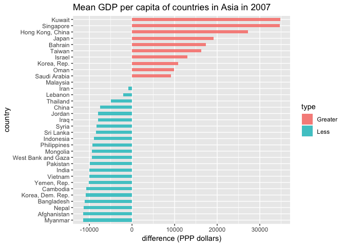
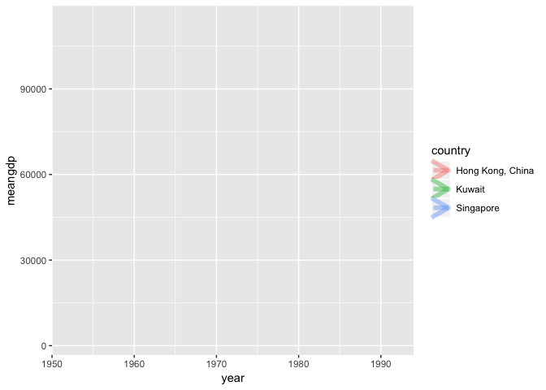
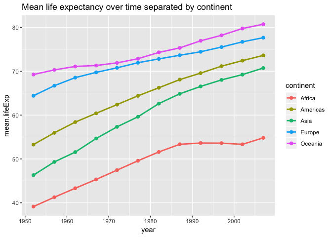
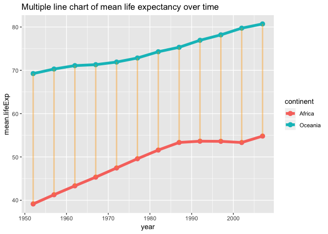

STAT545A-HW\#3-gapminder-exploration
================
Rachel Lobay
2018-09-27

Table of contents
=================

-   [Load gapminder data and peak at the data](#load-gapminder-data-and-peak-at-the-data)
-   [Three tasks for Gapminder data set](#three-tasks-for-gapminder-data-set)
-   [First task is to find max and min GDP per capita for all continents](#first-task-is-to-find-max-and-min-gdp-per-capita-for-all-continents)
    -   [Minimum and maximum GDP per capita by continent in table and barplot format](#minimum-and-maximum-gdp-per-capita-by-continent-in-table-and-barplot-format)
-   [Second task is to look at the spread of GDP per capita within continents](#second-task-is-to-look-at-the-spread-of-gdp-per-capita-within-continents)
    -   [Boxplots for spread of GDP per capita within continents](#boxplots-for-spread-of-gdp-per-capita-within-continents)
    -   [Table of spread of GDP per capita for the continents](#table-of-spread-of-gdp-per-capita-for-the-continents)
    -   [Extra for second task](#extra-for-second-task)
-   [Third task asks how is life expectancy changing over time on different continents](#third-task-asks-how-is-life-expectancy-changing-over-time-on-different-continents)

Load gapminder data and peak at the data
========================================

First, I will load the gapminder data. Also, I will load the ggplot2 package and I will load the dplyr package by loading the tidyverse package.

``` r
# Note that I suppressed the messages that appear when I used library() by typing ```{r message=FALSE} at the top of this code block. I found the easiest way to suppress the messages from multiple packages, insted of typing suppressPackageStartupMessages() around library() each time.

library(gapminder) # laod gapminder data

library(ggplot2) # laod ggplot2 package
library(tidyverse) # load tidyverse package
library(knitr) # for kable() function to make tables spiffy
```

I will have a peak at the top six rows of the gapminder data set, to get an idea of what I am working with.

``` r
head(gapminder) # See the top six rows of the Gapminder data set
```

    ## # A tibble: 6 x 6
    ##   country     continent  year lifeExp      pop gdpPercap
    ##   <fct>       <fct>     <int>   <dbl>    <int>     <dbl>
    ## 1 Afghanistan Asia       1952    28.8  8425333      779.
    ## 2 Afghanistan Asia       1957    30.3  9240934      821.
    ## 3 Afghanistan Asia       1962    32.0 10267083      853.
    ## 4 Afghanistan Asia       1967    34.0 11537966      836.
    ## 5 Afghanistan Asia       1972    36.1 13079460      740.
    ## 6 Afghanistan Asia       1977    38.4 14880372      786.

Three tasks for Gapminder data set
==================================

First task is to find max and min GDP per capita for all continents
===================================================================

My first task is to get the maximum and minimum of GDP per capita for all continents.

I will achieve by making use of the group\_by() function to group by continents. Then, I will summarize the minimum and maximum GDP per capita by using the summarize() function to make two columns: one with the minimum and one with the maximum GDP per capita.

``` r
minmaxGDPpercap.bycontinent <- gapminder %>% 
  group_by(continent) %>%  # group by continent
  summarize(minGDPpercap = min(gdpPercap), # use the summarize function to create two new columns, one with min and one with max GDP per capita
            maxGDPpercap = max(gdpPercap)) 

minmaxGDPpercap.bycontinent
```

    ## # A tibble: 5 x 3
    ##   continent minGDPpercap maxGDPpercap
    ##   <fct>            <dbl>        <dbl>
    ## 1 Africa            241.       21951.
    ## 2 Americas         1202.       42952.
    ## 3 Asia              331       113523.
    ## 4 Europe            974.       49357.
    ## 5 Oceania         10040.       34435.

Minimum and maximum GDP per capita by continent in table and barplot format
---------------------------------------------------------------------------

``` r
minmaxGDPpercap.bycontinent %>% 
  kable()
```

| continent |  minGDPpercap|  maxGDPpercap|
|:----------|-------------:|-------------:|
| Africa    |      241.1659|      21951.21|
| Americas  |     1201.6372|      42951.65|
| Asia      |      331.0000|     113523.13|
| Europe    |      973.5332|      49357.19|
| Oceania   |    10039.5956|      34435.37|

What gets our attention from the table? Oceania has the highest minGDPpercap at 10039.5956 dollars. Asia has the highest maxGDPpercap at 113523.13 dollars.

Note that Oceania appears to have a much larger minimum GDP per capita (near 10000 PPP dollars) than any other continent. This corroborates what we saw in the table.

Here is a bar chart of minimum GDP per capita by continent.

``` r
minmaxGDPpercap.bycontinent %>% 
  ggplot(aes(x = continent, y = minGDPpercap, fill = continent)) + 
  geom_col(alpha = 0.8) + # make bar plot of minGDPpercap by continent
  ggtitle("Bar chart of minimum GDP per capita by continent") 
```


The following is a bar chart of maximum GDP per capita by continent.

``` r
minmaxGDPpercap.bycontinent %>% 
  ggplot(aes(x = continent, y = maxGDPpercap, fill = continent)) + 
  geom_col(alpha = 0.8) + # make bar plot of maxGDPpercap by continent
  ggtitle("Bar chart of maximum GDP per capita by continent") 
```


We can see that Asia has a much higher GDP per capita than any of the other continents, which we could see is around 100000 PPP dollars.

In theory, it sounds like a good idea to plot the maximum and minimum values of GDP per capita for the continents side-by-side.

To accomplish this, we will use the reshape2 package to re-ogranize the data so that the maximum and minimum GDP are in one column. Then, we will use the facet function to arrange by continent.

``` r
suppressPackageStartupMessages(library(reshape2)) # load reshape2 package because we want to use melt function

# use the melt function to reogranize the data so that minGDPpercap and maxGDPpercap are in one column
df.melt <- melt(minmaxGDPpercap.bycontinent, id = "continent")


df.melt <- df.melt %>% # have a look at melted data frame grouped by continent
  select(continent, maxminGDPpercap = variable, GDPpercap.dollars = value) # rename column headers using the select() function as header names were changed to variable and value when we used the melt function

names(df.melt) # check that names of df.melt were changed as we intended above
```

    ## [1] "continent"         "maxminGDPpercap"   "GDPpercap.dollars"

``` r
df.melt %>% 
  ggplot(aes(x = maxminGDPpercap, y = GDPpercap.dollars, fill = continent)) +  
  geom_bar(stat = "identity", position = "dodge") + 
  facet_wrap(~continent) + # arrange by continent
  ggtitle("Bar charts of minumum and maximum GDP per capita by continent") + # add title 
  theme(axis.text.x = element_text(angle = 90, hjust = 1)) + # rotate x-axis text by 90 degrees, otherwise the x-axis labels will overlap. 
  xlab("maximum and minimum GDP per capita") + # x-axis label
  ylab("GDP per capita (PPP dollars)") + # y-axis label 
    scale_y_log10() # use a log scale on y-axis because large maxGDPpercap for Asia make it difficult to see other continents barplots
```


As we can see, the maximum and minimum values for the GDP per capita have too big a difference (in particular for Asia). As a result, it is difficult for us to interpret the minimum values in particular of the bar graphs. That is why I kept it simple above and just plotted the maximum and minimum values separately.

I will now display a variation of that final graph and a table of the continent, minGDPpercap and maxGDPpercap side-by-side. I am changing the display of the bar charts of minimum and maximum GDP per capita by continent. This is because if I use the multiple graphs that I obtained using facet\_wrap(~continent), they appear very small and squished when I put the table beside them.

Note I referred to the code [here](%22https://stackoverflow.com/questions/50858351/a-kableextra-table-and-a-ggplot-plot-on-same-row-in-rmarkdown-pdf-not-flexdas%22) to learn about tableGrob and placing a table side-by-side with a plot.

I will first load the gridExtra package because I want to use the grid.arrange() function to specify to arrange the table and plot side-by-side. Additionally, I will use a tableGrob with a minimal theme, because tableGrob is a table that is compatible with the gridExtra package.

``` r
library(gridExtra) # load gridExtra package 
```

    ## 
    ## Attaching package: 'gridExtra'

    ## The following object is masked from 'package:dplyr':
    ## 
    ##     combine

``` r
minmaxGDPpercap.barplot <- df.melt %>% 
  ggplot(aes(x = maxminGDPpercap, y = GDPpercap.dollars, fill = continent)) +  
  geom_bar(stat = "identity", position = "dodge") + 
  scale_y_log10() + # use a log scale because large maxGDPpercap for Asia make it difficult to see other continents barplots 
  theme(aspect.ratio=1, axis.text.x = element_text(angle = 90, hjust = 1)) + # rotate x-axis text by 90 degrees, otherwise the x-axis labels will overlap. 
  ggtitle("Bar charts of minumum and maximum GDP per capita coloured by continent") # add title 

  
minmaxGDPpercap.Grobtable <- tableGrob(minmaxGDPpercap.bycontinent, theme=ttheme_minimal(), rows=NULL)  # transform into a tableGrob

grid.arrange(minmaxGDPpercap.Grobtable, minmaxGDPpercap.barplot, nrow=1) # display plot and table side-by-side
```


Second task is to look at the spread of GDP per capita within continents
========================================================================

The second task that I will complete is to look at the spread of GDP per capita within the continents.

Boxplots for spread of GDP per capita within continents
=======================================================

Side-by-side boxplots strike me as a good way to see the differences in spread for all the continents together. The below boxplot design is credited to @RetoSterchi.

``` r
boxplotGDP.bycont <- gapminder %>% 
  ggplot(aes(x = continent, y = gdpPercap, fill = continent)) +
  geom_boxplot(alpha = 0.7) + # make a ggplot2 boxplot
  geom_jitter(aes(colour = continent), alpha = 0.2) +  # add jitter for the continents
  xlab("Continent") + # label the x-axis 
  ylab("GDP per capita (PPP dollars)") + # label the y-axis 
  ggtitle("GDP per capita by continent") +
  scale_y_log10() # use a log scale because high GDP per capita outliers for Asia make it difficult to see other boxplots

boxplotGDP.bycont
```


What can we see from the boxplots? Asia looks to have a very large spread spread, while Oceania looks to have the smallest spread and quite a high GDP per capita overall. Africa's IQR (box in the boxplot) has smaller values of GDP per capita than most of the other continents (particularly in comparison with Oceania).

Table of spread of GDP per capita for the continents
----------------------------------------------------

Let's look at the summary of the standard deviation, IQR, maximum and minimum values of the gdpPercap by using a combination of group\_by() and summarize() functions as we did in class. I will display this data in a simple kable table.

``` r
spread.bycontinent <- gapminder %>% 
  group_by(continent) %>% 
  summarize(sd.gdpPercap = sd(gdpPercap), # find sd for each continent
            IQR.gdpPercap = IQR(gdpPercap), # find IQR for each continent
            min.gdpPercap = min(gdpPercap), # find min gdpPercap for each continent
            max.gdpPercap = max(gdpPercap)) # find max gdpPercap for each continent
  
spread.bycontinent %>% 
  kable() # put spread data for continents in a kable table
```

| continent |  sd.gdpPercap|  IQR.gdpPercap|  min.gdpPercap|  max.gdpPercap|
|:----------|-------------:|--------------:|--------------:|--------------:|
| Africa    |      2827.930|       1616.170|       241.1659|       21951.21|
| Americas  |      6396.764|       4402.431|      1201.6372|       42951.65|
| Asia      |     14045.373|       7492.262|       331.0000|      113523.13|
| Europe    |      9355.213|      13248.301|       973.5332|       49357.19|
| Oceania   |      6358.983|       8072.258|     10039.5956|       34435.37|

Asia has the largest standard deviation for GDP per capita, which is 14045.373 PPP dollars. Africa has the smallest standard deviation, which is 2827.930 PPP dollars. Interestingly, the IQR range (which is the 3rd quartile - the first quartile) is very large for Europe at 13248.301 PPP dollars. The IQR is quite small for Africa, which is 1616.170 PPP dollars.

The minimum GDP per capita for Oceania is very high at 10039.5956 PPP dollars, while for Africa it is very low at 241.1659 PPP dollars.

We see Asia has a very large maximum GDP per capita value, which is 113523.13 PPP dollars. That very large maximum value would likely be classified as an outlier.

There are a few key points from our analysis of the spread. Europe has the largest IQR range at 13248.301 PPP dollars, meaning there is a large spread in GDP per capita in European countries that were analyzed. We determine that Asia, in particular, has a very large standard deivation and hence a a large spread in terms of GDP per capita. This may mean that there is great dispersion in the standards of living. Africa has a relatively low GDP per capita and spread of GDP per capital overall. Africa has the smallest minimum GDP per capita out of all of the continents at 241.1659 PPP dollars. Finally, Oceania has a very high minimum GDP per capita at 10039.5956 PPP dollars, meaning that the standard of living is generally quite high.

Both table and boxplots displayed next to each other
----------------------------------------------------

What I am going to do next is to show that the table and boxplot can be displayed next to each other. First, I will drop the IQR.gdpPercap column in the table because I want to limit the information from the table to the standard deviation, min and max values. Again, I will use a tableGrob, but this time instead of a minimal theme, I will try a grey theme. I will also make the text smaller in the table ([see here for reference](https://stackoverflow.com/questions/31776557/how-to-adjust-the-font-size-of-tablegrob)) so that the boxplot will hopefully have more room to be displayed. Additionally, I will change the table text color to navy for readability.

``` r
spread.bycontinent <- within(spread.bycontinent, rm("IQR.gdpPercap")) # remove IQR.gdpPercap column from data frame

spread.bycontinent.Grobtable <- tableGrob(spread.bycontinent , theme=ttheme_default( # transform into a tableGrob with default theme
    core = list(fg_params=list(cex = 0.65)), # smaller table text size
    colhead = list(fg_params=list(cex = 0.7)), 
    rowhead = list(fg_params=list(cex = 0.7)), base_colour = "navy"), rows=NULL)  

grid.arrange(spread.bycontinent.Grobtable, boxplotGDP.bycont + coord_flip(), nrow=1) # display coordinate flipped plot and table side-by-side
```


Extra for this task
-------------------

Since we've identified some interesting tidbits about the spread, we can look at the GDP per capita more closely for continents we would like to investigate more.

For example, I am curious about the GDP per capita of the countries in Asia. Which countries have a higher GDP per capita overall and which have a very low GDP per capita? There seems to be quite a large spread, which we saw from the box plot... so there should be a dispersion in the GDP per capita by country. We shall look at a diverging bar chart of countries in Asia in 2007 to investigate this.

Note that I am manipulating the code from the diverging bar chart from [here](%22https://www.trafforddatalab.io/graphics_companion/%22)

``` r
df <- gapminder %>% 
  filter(year == 2007 & continent == "Asia") %>% 
  mutate(mean = mean(gdpPercap), difference = gdpPercap - mean, type = if_else(gdpPercap < mean, "Less","Greater")) %>% 
  arrange(difference) %>% # arrange by difference first (lowest to highest)
  mutate(country = factor(country, levels = country))  # mutate country so that the countries are sorted (from lowest to highest difference) and by country
  
head(df) # make sure three new columns for mean, difference, and type were added to data frame
```

    ## # A tibble: 6 x 9
    ##   country continent  year lifeExp    pop gdpPercap   mean difference type 
    ##   <fct>   <fct>     <int>   <dbl>  <int>     <dbl>  <dbl>      <dbl> <chr>
    ## 1 Myanmar Asia       2007    62.1 4.78e7      944  12473.    -11529. Less 
    ## 2 Afghan… Asia       2007    43.8 3.19e7      975. 12473.    -11498. Less 
    ## 3 Nepal   Asia       2007    63.8 2.89e7     1091. 12473.    -11382. Less 
    ## 4 Bangla… Asia       2007    64.1 1.50e8     1391. 12473.    -11082. Less 
    ## 5 Korea,… Asia       2007    67.3 2.33e7     1593. 12473.    -10880. Less 
    ## 6 Cambod… Asia       2007    59.7 1.41e7     1714. 12473.    -10759. Less

``` r
df %>% 
  ggplot( aes(x = country, y = difference, label = country)) + 
  geom_col(aes(fill = type), width = 0.5, alpha = 0.8) +
  coord_flip() + # flip x and y axes so bar plots are displayed horizontally
  ggtitle("Mean GDP per capita of countries in Asia in 2007") + 
  ylab("difference (PPP dollars)")
```



We can spot that Singapore, Kuwait, and Hong Kong have a high mean GDP per capita of over 25,000 PPP dollars in 2007. In contrast, Myanmar, Nepal, and Afghanistan have a very low GDP per capita of less than - 10,000 PPP dollars in 2007.

Let's go back in time. We will hone in on Singapore, Kuwait, and Hong Kong and see how their mean GDP per capita changed over the years. Did they always have a high mean GDP per capita? Probably not. Also, we will look at the years below 1992 because we already have seen information about the mean GDP per capita of each of the countries in 2007. Our focus, now, is on the GDP per capita leading up to that.

We will use a combination of ggplot2 and gganimate packages to see this.

``` r
library(devtools) # load devtools pacckage

devtools::install_github('thomasp85/gganimate') # install gganimate package this way because it is not installing when we use the install.packages() function with R 3.5.1. Also, gganimate is Github-based (not based on CRAN).

devtools::install_github("thomasp85/transformr")  # same deal with transformr, which is needed to draw the animated lines below

library(gganimate) # laod gganimate package
library(transformr) # load transformr package to draw line

lifeExp.bycontyr <- gapminder %>% 
  select(country, year, gdpPercap) %>% # only select country, year, and gdpPercap columns
  filter((country == "Kuwait" | country == "Singapore" | country == "Hong Kong, China") & year <= 1992) %>%
  group_by(country, year) %>% # group by country and year
  mutate(meangdp = mean(gdpPercap)) %>% # add mean gdpPercap columnr
  ggplot(aes(x =  year, y = meangdp, color = country, group = country)) +
  geom_path(size = 2, alpha = 0.4, arrow = arrow()) + # lines of the mean gdpPercap of the 3 countries over the years
  # gganimate code parts are below 
  transition_reveal(year, year) # transitions are the years

lifeExp.bycontyr # let's see the animation!
```



Note that the animation may appear slow on github. I was looking for options on how to get the frame speed to go faster when I use transition\_reveal() but I have not been able to find a quick and easy solution.

Third task asks how is life expectancy changing over time on different continents
=================================================================================

The task I am going to tackle is "How is life expectancy changing over time on different continents?"

However, I am going to make the task have a more specific objective. I will specify that I will follow the the mean life expectancy for each continent. So, the question now is how is the **mean** life expectancy changes over time for the differenct continents.

``` r
mean.lifeExp.bycontinentyear <- gapminder %>% 
  group_by(continent, year) %>% # group by continent and year
  summarize(mean.lifeExp = mean(lifeExp)) 


mean.lifeExp.bycontinentyear %>%  # summarize the mean life expectancy from 1952 - 2007 over 5 year periods for each continent
  kable() # table of the mean life expectancy grouped by continent and year (over 5 year periods from 1952 - 2007)
```

| continent |  year|  mean.lifeExp|
|:----------|-----:|-------------:|
| Africa    |  1952|      39.13550|
| Africa    |  1957|      41.26635|
| Africa    |  1962|      43.31944|
| Africa    |  1967|      45.33454|
| Africa    |  1972|      47.45094|
| Africa    |  1977|      49.58042|
| Africa    |  1982|      51.59287|
| Africa    |  1987|      53.34479|
| Africa    |  1992|      53.62958|
| Africa    |  1997|      53.59827|
| Africa    |  2002|      53.32523|
| Africa    |  2007|      54.80604|
| Americas  |  1952|      53.27984|
| Americas  |  1957|      55.96028|
| Americas  |  1962|      58.39876|
| Americas  |  1967|      60.41092|
| Americas  |  1972|      62.39492|
| Americas  |  1977|      64.39156|
| Americas  |  1982|      66.22884|
| Americas  |  1987|      68.09072|
| Americas  |  1992|      69.56836|
| Americas  |  1997|      71.15048|
| Americas  |  2002|      72.42204|
| Americas  |  2007|      73.60812|
| Asia      |  1952|      46.31439|
| Asia      |  1957|      49.31854|
| Asia      |  1962|      51.56322|
| Asia      |  1967|      54.66364|
| Asia      |  1972|      57.31927|
| Asia      |  1977|      59.61056|
| Asia      |  1982|      62.61794|
| Asia      |  1987|      64.85118|
| Asia      |  1992|      66.53721|
| Asia      |  1997|      68.02052|
| Asia      |  2002|      69.23388|
| Asia      |  2007|      70.72848|
| Europe    |  1952|      64.40850|
| Europe    |  1957|      66.70307|
| Europe    |  1962|      68.53923|
| Europe    |  1967|      69.73760|
| Europe    |  1972|      70.77503|
| Europe    |  1977|      71.93777|
| Europe    |  1982|      72.80640|
| Europe    |  1987|      73.64217|
| Europe    |  1992|      74.44010|
| Europe    |  1997|      75.50517|
| Europe    |  2002|      76.70060|
| Europe    |  2007|      77.64860|
| Oceania   |  1952|      69.25500|
| Oceania   |  1957|      70.29500|
| Oceania   |  1962|      71.08500|
| Oceania   |  1967|      71.31000|
| Oceania   |  1972|      71.91000|
| Oceania   |  1977|      72.85500|
| Oceania   |  1982|      74.29000|
| Oceania   |  1987|      75.32000|
| Oceania   |  1992|      76.94500|
| Oceania   |  1997|      78.19000|
| Oceania   |  2002|      79.74000|
| Oceania   |  2007|      80.71950|

We can visualize the mean life expectancy over time separated by continent by using a multiple line chart.

``` r
mean.lifeExp.bycontinentyear %>% 
  ggplot(aes(x = year, y = mean.lifeExp, colour = continent)) +
  geom_line(size = 1) + # add lines to track the life expectancy for the continents over time
  geom_point(size = 2) + # add points to the lines for the years. 
  ggtitle("Mean life expectancy over time separated by continent")
```



``` r
mean.lifeExp.bycontinentyear
```

    ## # A tibble: 60 x 3
    ## # Groups:   continent [5]
    ##    continent  year mean.lifeExp
    ##    <fct>     <int>        <dbl>
    ##  1 Africa     1952         39.1
    ##  2 Africa     1957         41.3
    ##  3 Africa     1962         43.3
    ##  4 Africa     1967         45.3
    ##  5 Africa     1972         47.5
    ##  6 Africa     1977         49.6
    ##  7 Africa     1982         51.6
    ##  8 Africa     1987         53.3
    ##  9 Africa     1992         53.6
    ## 10 Africa     1997         53.6
    ## # ... with 50 more rows

It is great that the mean life expectancy for the continents have an increasing trend (for the most part). Africa, however, has a bit of a downward trend in life expectancy from 1990 to 2000 where it begins to increase again. That may be, in part, due to the HIV/AIDS epidemic. Oceania has the highest mean life expectacy of all the continents and is closely followed by Europe. Oceania's mean life expectancy started just below 70 years old in the 1950s, which is a very high rate to begin with! The mean life expectancy for Oceania rose to just over 80 by 2007.

From the multiple line graph, we see that Africa consistently has the lowest mean life expectancy and Oceania consistently has the highest mean life expectancy over the years. So, it may be interesting to see a side-by-side comparison of the mean life expectancy values for those two continents over the years. Hence I will select the tables of just those two continents and display them side-by-side using the gridExtra package and tableGrob.

``` r
mean.lifeExp.Africa <- tableGrob(mean.lifeExp.bycontinentyear[1:12,]) # table of Africa rows
mean.lifeExp.Oceania<- tableGrob(mean.lifeExp.bycontinentyear[49:60,]) # table of Oceania rows

haligned <- gtable_combine(mean.lifeExp.Africa, mean.lifeExp.Oceania, along = 1) # combine along row

grid.arrange(haligned, nrow = 1) # display tables side-by-side
```



From seeing these tables side-by-side, it is easy to see exactly how different numerically the mean life expectancy differs over the years for the continents. It is crazy to think that in 2007 (according to this data) the mean life expectancy differed for Africa and Oceania by 80.71 - 54.81 = 25.90 years!
